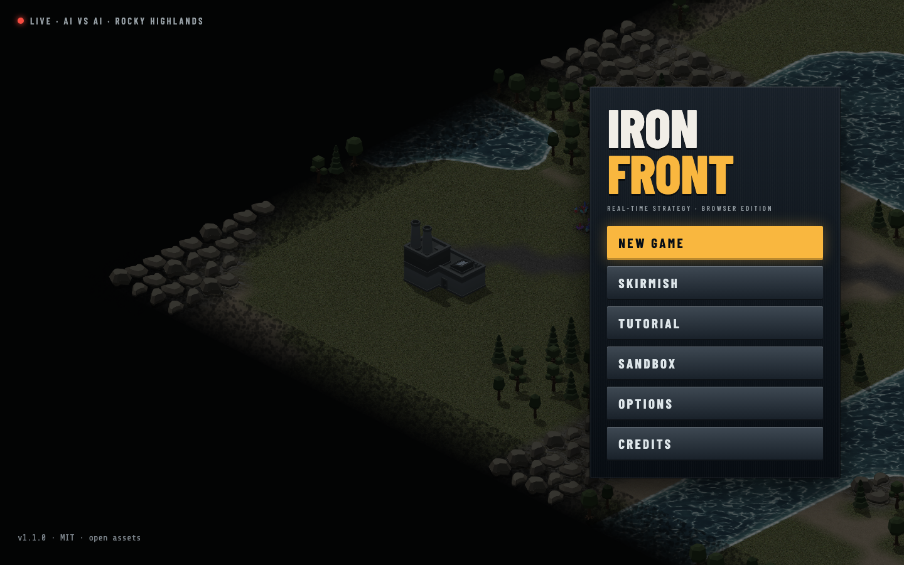
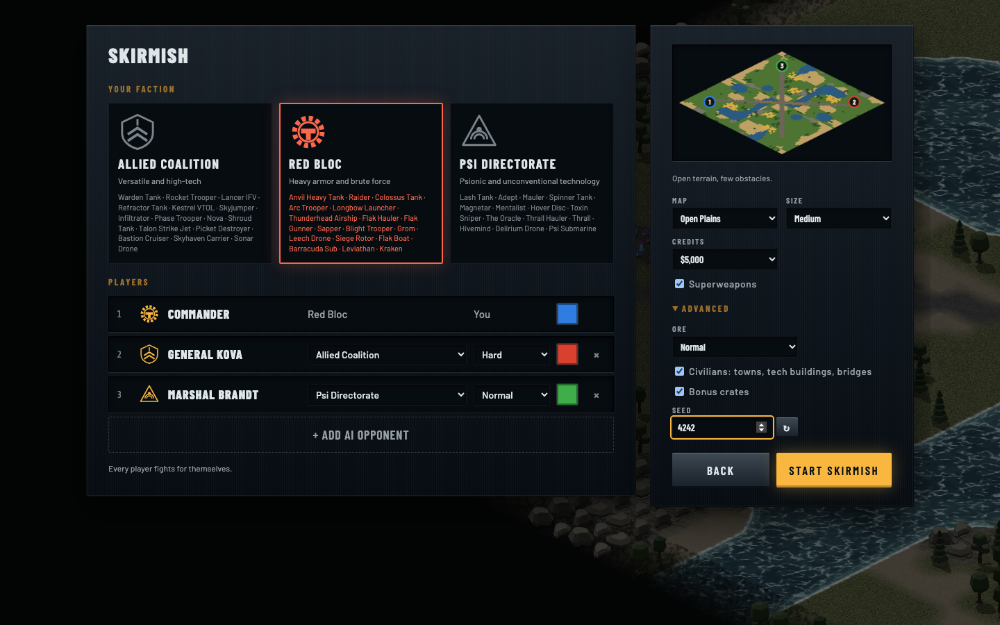
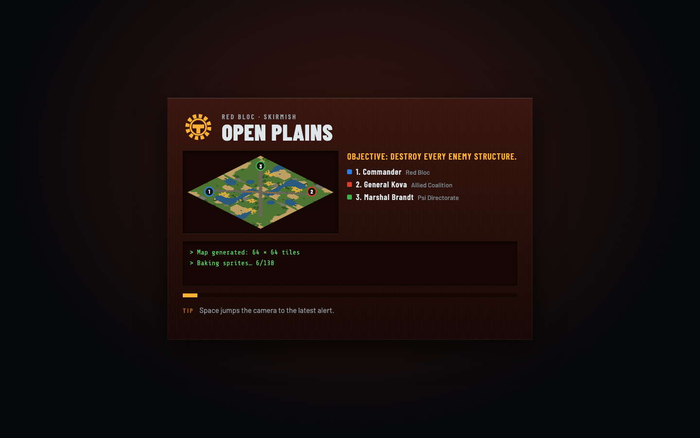
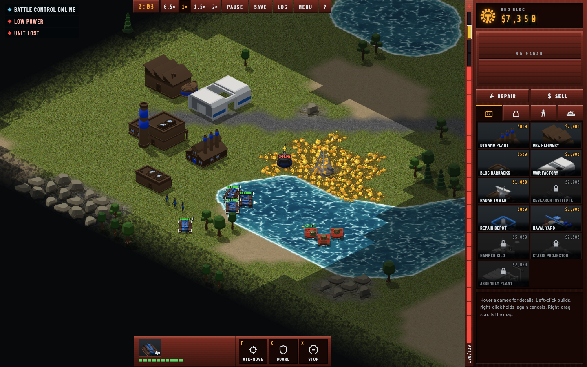
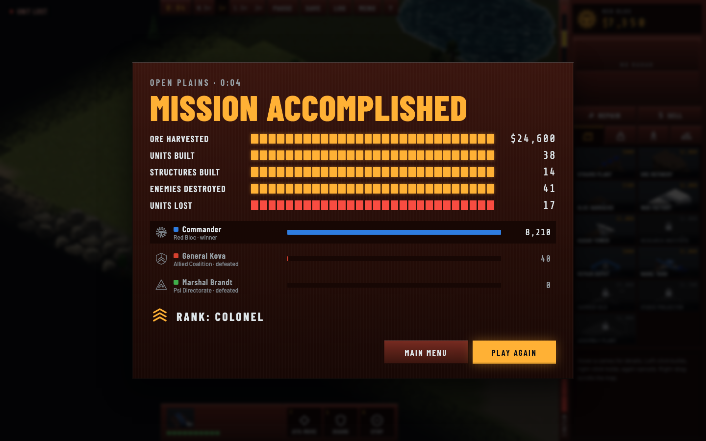

# Iron Front — Browser RTS

An independent isometric real-time strategy game for the browser (React + three.js + Vite).

```sh
npm install
npm run dev      # development server
npm run build    # type-check + production build (dist/)
npm test         # simulation tests (vitest)
```



| | |
|---|---|
|  |  |
|  |  |

## Licences

### Code

The source code is licensed under the **MIT License**. See `LICENSE`.

### Assets

The game assets in `public/assets/` are **not** covered by the code licence. Each asset keeps its own licence (CC0 1.0, CC-BY 3.0 or CC-BY 4.0), as listed in:

- `public/assets/licenses/CREDITS.txt` — source, author, licence and changes for every third-party asset
- `public/assets/licenses/*.txt` — the original licence notes per pack
- `docs/asset-register.md` — full asset register (status, edits, check dates)

CC-BY assets must be credited when redistributed; the in-game Credits screen (main menu → Credits) shows the required attribution.

### Trademarks

This is an independent game inspired by classic isometric RTS games. It contains no assets, music, voices or logos from Command & Conquer or other Electronic Arts products, and is not affiliated with or endorsed by Electronic Arts.

## Tests

| Commando | Wat |
|---|---|
| `npm test` | Unit-/simulatietests (vitest), incl. een korte soak-test |
| `npm run e2e` | End-to-end in Chromium, Firefox en WebKit (Playwright; eenmalig `npx playwright install`) |
| `npm run soak` | 24 volledige AI-potjes met invariantcontroles |
| `DUELS=1 npx vitest run duels --silent=false` | Duelmatrix (alle gevechtsunits, gelijk budget) en balansscenario's; rapport in `docs/balans/` |
| `BALANCE=all npx vitest run balance.test` | AI-vs-AI balansmeting als volledige kruising (factiepaar × kaart × seed). Opties staan bovenaan `src/game/tests/balance.test.ts`, o.a. `BALANCE_REPORT=<label>` (rapport + JSON in `docs/metingen/`), `BALANCE_MAPS=coast,islands`, `BALANCE_NOSW=1`, `BALANCE_PART=1/4` |
| `DUELS=1 DUELS_SEA=1 npx vitest run duels` · `REGRESS=1 npx vitest run duels` | Zeematrix · regressiescenario's (Fun Pass 20.3) |
| `tools/nulmeting.sh [prefix]` | Alle runs van de nulmeting (Fun Pass 20.6), een paar minuten |
| `tools/tijdlijn.html` | Tijdlijn van een "Export match data"-bestand (in de browser openen) |

| `SCREENSHOTS=1 npx playwright test e2e/screenshots.e2e.ts --project=chromium` | De screenshots hierboven opnieuw maken (`docs/screenshots/`) |

Pixel-baselines (`e2e/*-snapshots/`) gelden alleen voor Chromium op macOS. Na een bewuste visuele wijziging: `npx playwright test --project=chromium --update-snapshots` en de nieuwe beelden nakijken.

## Versie 1.3.0

Balansronde voor alle units: mind control laadt eerst op, helden zijn sterk maar niet beslissend, zwakke units bruikbaar gemaakt. Plus de meetinstrumenten van de Fun Pass (telemetrie, export, nulmeting). Zie `CHANGELOG.md`, `plan/balans-plan.md` en `docs/TODO.md`.

## Versie 1.2.0

UX-redesign "Command Console": factieconsole als HUD, announcers en unitstemmen, leesbaar slagveld, nieuw menu/lobby/briefing/score en toegankelijkheidsopties. Zie `CHANGELOG.md`; per fase de uitleg in `docs/TODO.md` (fase 14–19), het plan in `plan/ux-plan.md`.

## Versie 1.1.0

Uitbreiding ten opzichte van 1.0: zie `CHANGELOG.md`. Per fase staat de uitleg in `docs/TODO.md`, en het plan in `plan/uitbreidingsplan.md`.
